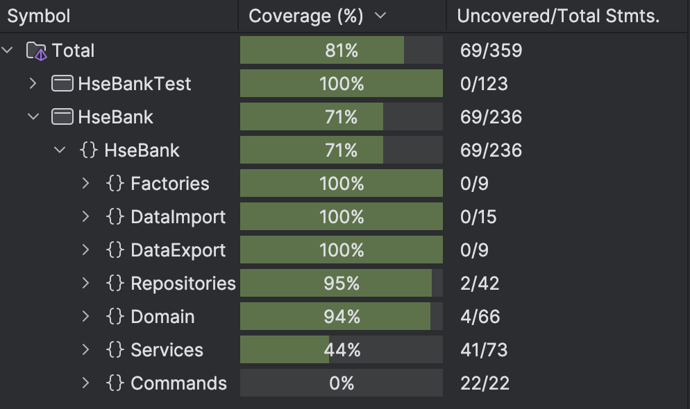

### Анохин Антон БПИ237

## КПО КР1

### 1. Что есть
 
- **Работа с банковскими счетами**: создание, удаление, просмотр.  
- **Категории доходов и расходов**: создание, удаление, просмотр.  
- **Операции**: добавление доходов и расходов, привязка к счёту и категории.  
- **Аналитика**: просмотр баланса по счетам, группировка операций по категориям.  
- **Импорт/экспорт данных в JSON**: сохранение состояния приложения в файл и загрузка данных при следующем запуске(YAML и CSV решил не делать, так как в задании сказано, что могу делать на выбор).  
- **Интерактивное консольное меню с** (использую Spectre.Console).  

### 2. Применение SOLID и GRASP

**SOLID:**  
- **S (Single Responsibility Principle)** – Каждый класс выполняет только одну задачу. 
- **O (Open/Closed Principle)** – Код поддерживает расширяемость. Например, новый формат данных (CSV, YAML) можно добавить, создав новый класс, не изменяя существующие.
- **L (Liskov Substitution Principle)** – Наследуемые классы могут заменять базовые (например, `JsonImporter` наследуется от `DataImporter`).  
- **I (Interface Segregation Principle)** – Использую специальные интерефесы, например `ICommand` для команд.  
- **D (Dependency Inversion Principle)** – Используется DI-контейнер `Microsoft.Extensions.DependencyInjection`.
  
**GRASP:**  
- **High Cohesion (Высокая связность)** – Каждый модуль чётко выполняет свою функцию.  
- **Low Coupling (Низкая связность)** – Компоненты взаимодействуют через интерфейсы и DI-контейнер, что упрощает замену зависимостей.  
- **Controller (Контроллер)** – `FinanceFacade` выполняет роль контроллера, обрабатывая запросы пользователей и управляя бизнес-логикой.  

### 3. Использованные паттерны GoF

| Паттерн                               | Где используется                      | Описание                                                                                      |
| ------------------------------------- | ------------------------------------- | --------------------------------------------------------------------------------------------- |
| **Фабрика (Factory Method)**          | `DomainFactory`                       | Централизованное создание объектов (счётов, категорий, операций).                             |
| **Фасад (Facade)**                    | `FinanceFacade`                       | Упрощает работу с доменной моделью, предоставляя единый интерфейс.                            |
| **Команда (Command)**                 | `AddOperationCommand`, `TimedCommand` | Реализует сценарии пользователя (например, создание операции) и позволяет декорировать их.    |
| **Декоратор (Decorator)**             | `TimedCommand`                        | Добавляет функциональность (измерение времени выполнения команд) без изменения логики команд. |
| **Шаблонный метод (Template Method)** | `DataImporter`                        | Определяет базовый алгоритм импорта данных с возможностью расширения (разные форматы файлов). |
| **Посетитель (Visitor)**              | `JsonExporter`                        | Позволяет экспортировать данные в JSON, не изменяя классы доменной модели.                    |
| **Прокси (Proxy)**                    | `RepositoryProxy`                     | Кеширует данные, снижая нагрузку на "базу данных" (в данном случае `DataRepository`).         |

### Тесты

Тесты находятся в `HseBankTest`, покрытие как мы видим больше 65%

### 5. Инструкция по запуску

Для запуска основной программы, нужно чтобы был скачан Spectre.Console и Microsoft.Extensions.DependencyInjection. Для тестов нужно скачать Xunit, FluentAssertions, Moq. Я пишу в Rider, поэтому добавлял все через NuGet
