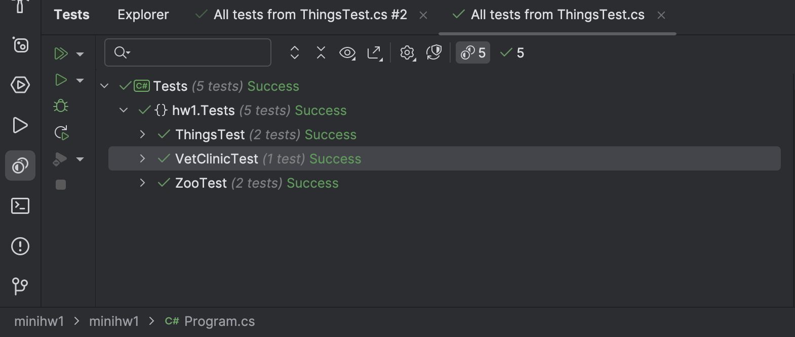

### Анохин Антон БПИ237

## КПО мини дз 1

Пояснения по решению: для менюшки использовал пакет `Spectre.Console`, чтобы было удобно и красиво(Главное при запуске сделайте консоль побольше!). Еще в тз нет точной информации как проверять животного на здоровье, поэтому ветклиника просто на радном с вероятностью 50% решает, здорово ли животное или нет.

### Архитектура:

- в папке с проектом находится _Program.cs_, в котором происходит работа с DI container, и запускается менюшка.
- в папке __Services__ находятся основные классы, которые и будут использоваться в DIC: _Menu.cs_, _VetClinic.cs_, _Zoo.cs_
- в папке __Models/Animals__ находятся все классы с животными, __Models/Interfaces__ интерфесы, а в __Models/Things__ вещи.

### SOLID:
- __Single Responsibility Principle (SRP)__: Каждый класс имеет одну ответственность. Например, Zoo отвечает за управление животными и вещами, а VetClinic — за проверку здоровья.
- __Open/Closed Principle (OCP)__: Классы открыты для расширения, но закрыты для модификации. Например, можно добавить новые типы животных, не изменяя существующий код.
- __Liskov Substitution Principle (LSP)__: Производные классы (например, Monkey, Rabbit, Tiger, Wolf) могут использоваться вместо базового класса Animal, так как наследуют все его свойства и поведение.
- __ISP (Interface Segregation Principle)__: Интерфейсы IAlive и IInventory разделяют ответственность, позволяя классам реализовывать только нужный функционал.
- Dependency Inversion Principle (DIP): Зависимости инжектируются через DI-контейнер из-за чего выполняется условие: абстракции не должны зависеть от деталей. Детали должны зависеть от абстракций.

### Тестирование
Написал 3 класса с тестами: __VetClinicTest__, __ZooTest__, __ThingsTest__. Также можно еще написать тесты для животных, но там будет тоже самое, что и в Things. Распологается в __Tests__:

### Запуск программы
Для запуска основной программы, нужно чтобы был скачан Spectre.Console и Microsoft.Extensions.DependencyInjection. Для тестов нужно скачать Xunit. Я пишу в Rider, поэтому добавлял все через NuGet