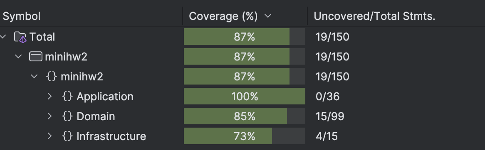

# мини-ДЗ 2  
### Анохин Антон БПИ237

**Весь функционал был проверен при помощи Swagger, код работает так, как и ожидалось**

---

### Domain-Driven Design (DDD)

| Концепция DDD                                | Применение                                                                 |
| -------------------------------------------- | -------------------------------------------------------------------------- |
| **Entities (Сущности)**                      | `Animal`, `Enclosure`, `FeedingSchedule` в слое `Domain`                   |
| **Value Objects (Объекты-значения)**         | `Food` — строка еды, используемый в `Animal` как неизменяемый объект       |
| **Business Logic in Entities**               | Методы `Feed()`, `Treat()`, `MoveTo()`, `AddAnimal()` инкапсулируют логику |
| **Domain Events**                            | `AnimalMovedEvent`, `FeedingTimeEvent` создаются в `Domain` при событиях   |
| **Bounded Context (ограниченные контексты)** | Контексты животных, вольеров и расписания кормлений разделены              |

---

### Clean Architecture

| Принцип Clean Architecture                          | Применение и классы                                                                   |
| --------------------------------------------------- | ------------------------------------------------------------------------------------- |
| **Разделение по слоям**                             | Слои: `Domain`, `Properties`, `Infrastructure`, `Presentation`                        |
| **Domain не зависит ни от чего**                    | `Domain` — не содержит ссылок на внешние сервисы или библиотеки                       |
| **Application зависит только от Domain**            | Сервисы `AnimalTransferService`, `FeedingOrganizationService`, `ZooStatisticsService` |
| **Infrastructure реализует интерфейсы Application** | `Repository` реализуют интерфейсы репозиториев                                        |
| **Presentation (Web API) зависит от Application**   | Контроллеры вызывают сервисы через DI                                                 |
| **Инверсия зависимостей**                           | Внедрение зависимостей (`IAnimalRepository`, и т.д.) через конструкторы               |
| **Интерфейсы вместо прямых зависимостей**           | Все репозитории и сервисы внедряются по интерфейсам                                   |
| **Конфигурация приложения через Program.cs**        | Настройка слоёв, DI и Swagger в `Program.cs`                                          |

---

### Покрытие unit тестами

